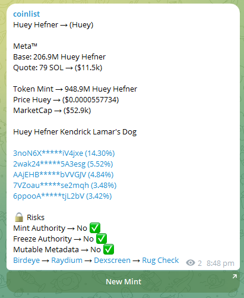

# Solana New Pools

Groundbreaking Solana Liquidity Pool Watcher script, your ultimate companion for staying ahead in the decentralized finance (DeFi) landscape! Seamlessly integrated into the Solana blockchain ecosystem, this script tirelessly monitors the creation of new liquidity pools in real-time, ensuring you never miss a beat in the vibrant world of DeFi opportunities.


## Running App

1. Fork `https://github.com/debugtitan/new-pool-solana.git` repository into your own namespace such as `yourusername/new-pool-solana`.

2. Clone your project locally:

```bash
git clone https://github.com/debugtitan/new-pool-solana.git 
cd new-pool-solana
```

- Run JavaScript App
    - move to JavaScript dir
        -  ``` 
            cd pools_js 
            ```
    - install dependacies
        - ` npm i `
    - setup required env
    - start app locally
        - ` npm run dev `

- Run Python App
    - redirect to Python dir
        - ```
          cd pools_py
          ```
    - create your virtual environment
    - launch your virtual environment
    - install packages
        - ```
          pip install -r requirements.txt
          ```
    - start app
        - ` python app.py `


# Tasks
- [x] codebase setup
- [x] cross language integration
- [x] web3 implementation
- [x] event listener 
- [x] telegram bot integration
- [x] app testing

    
    
